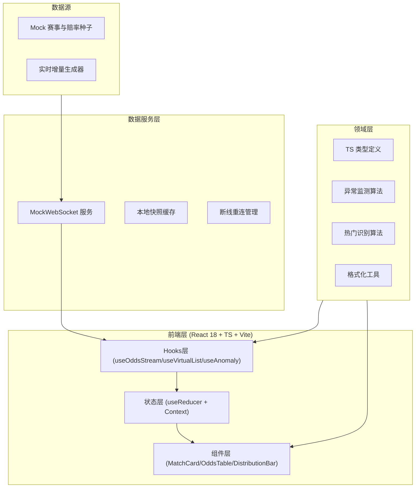
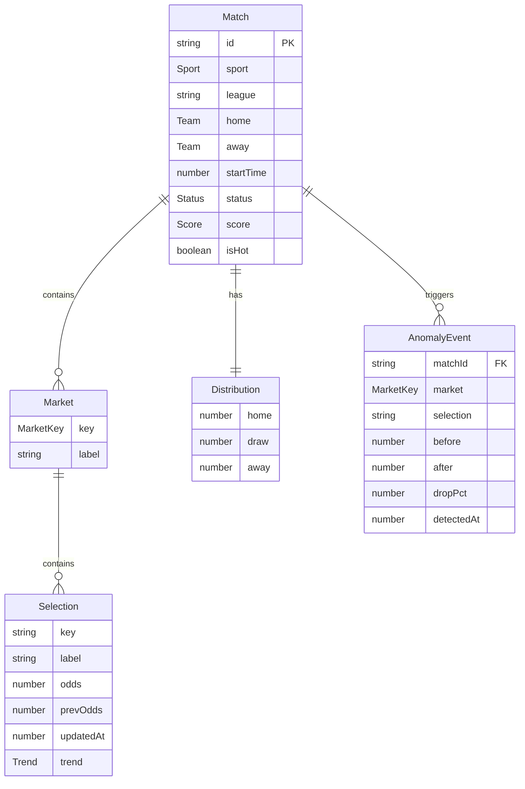

# 体育赛事实时赔率展示面板 — 技术架构文档

## 1. 架构设计



## 2. 技术说明

- **前端**：React@18 + TypeScript + Vite
- **样式**：TailwindCSS@3 + CSS 变量（主题色与反馈色）
- **状态管理**：React Hooks（`useReducer` 集中管理赔率快照，`useMemo`/`useCallback` 避免重渲染）
- **虚拟滚动**：自定义 `useVirtualList` Hook（基于容器可视区与行高动态切片渲染）
- **实时数据**：`MockWebSocket` 服务，模拟连接/增量推送/断线/重连，对外暴露与真实 WebSocket 一致的 API
- **动画**：CSS Keyframes 处理闪烁/脉冲（性能优先，避免重排），`framer-motion` 处理卡片入场
- **测试**：Vitest + React Testing Library（单元 + 集成），@testing-library/user-event 模拟交互
- **后端/数据库**：无后端依赖，采用 Mock 数据与模拟 WebSocket；预留真实 WebSocket 适配层接口

## 3. 路由定义

| 路由 | 用途 |
|------|------|
| `/` | 赔率看板主页（赛事列表 + 赔率 + 分布 + 监测） |

## 4. 接口定义（Mock WebSocket 协议）

前端通过 `MockWebSocket` 对外暴露与浏览器 `WebSocket` 等价接口，消息采用 JSON：

```typescript
// 服务端 → 客户端：初始快照
interface SnapshotMessage {
  type: 'snapshot';
  matches: Match[];
  serverTime: number;
}

// 服务端 → 客户端：赔率增量
interface OddsUpdateMessage {
  type: 'odds_update';
  matchId: string;
  market: MarketKey;          // '1x2' | 'handicap' | 'overUnder' | 'cs' | 'goals'
  selection: string;           // 选项键，如 'home' | 'draw' | 'away' | 'over' ...
  odds: number;
  timestamp: number;
}

// 服务端 → 客户端：投注分布更新
interface DistributionMessage {
  type: 'distribution';
  matchId: string;
  distribution: { home: number; draw: number; away: number };
}

// 客户端 → 服务端：订阅
interface SubscribeMessage {
  type: 'subscribe';
  filters: { date: 'today' | 'tomorrow'; sports: Sport[]; league?: string };
}
```

## 5. 数据模型

### 5.1 数据模型定义



### 5.2 类型定义（核心 TypeScript 类型）

```typescript
export type Sport = 'football' | 'basketball' | 'tennis';
export type Status = 'scheduled' | 'live' | 'finished';
export type MarketKey = '1x2' | 'handicap' | 'overUnder' | 'cs' | 'goals';
export type Trend = 'up' | 'down' | 'stable';

export interface Team { name: string; logo: string; }
export interface Score { home: number; away: number; }
export interface Selection { key: string; label: string; odds: number; prevOdds: number; updatedAt: number; trend: Trend; }
export interface Market { key: MarketKey; label: string; selections: Selection[]; line?: number; }
export interface Distribution { home: number; draw: number; away: number; }
export interface AnomalyEvent { matchId: string; market: MarketKey; selection: string; before: number; after: number; dropPct: number; detectedAt: number; }
export interface Match {
  id: string; sport: Sport; league: string;
  home: Team; away: Team; startTime: number;
  status: Status; score: Score;
  markets: Market[]; distribution: Distribution;
  isHot: boolean; date: 'today' | 'tomorrow';
}
```

## 6. 关键算法

### 6.1 异常波动监测

- 维护每个赔率选项最近 5 分钟的 `odds` 时间序列（环形缓冲）。
- 当 `dropPct = (before - after) / before >= 0.20` 且时间窗 ≤ 5 分钟时，生成 `AnomalyEvent`，触发红色脉冲警示。
- 阈值常量 `ANOMALY_WINDOW_MS = 5 * 60 * 1000`，`ANOMALY_THRESHOLD = 0.20`。

### 6.2 热门赛事识别

- 综合评分：`score = w1*投注总量 + w2*赔率变化频率 + w3*异常事件数 + w4*是否进行中`。
- 归一化后取 Top-N 置顶，`isHot = true`，添加琥珀金"火热"徽章。

### 6.3 虚拟滚动

- `useVirtualList`：监听容器 `scrollTop` 与 `clientHeight`，结合固定/动态行高 `rowHeight`，计算 `startIdx/endIdx`，仅渲染可视区 + 缓冲行，外层用 `transform: translateY` 占位撑高，避免大量 DOM。

## 7. 性能与可靠性

- **避免重渲染**：赔率增量按 `matchId + selection` 精准更新；`MatchCard` 用 `React.memo` + 自定义 `areEqual`；列表项 key 稳定。
- **节流刷新**：批量合并 16ms 内的增量，单帧统一 flush。
- **缓存与重连**：本地 `Map` 快照缓存最近状态；`MockWebSocket` 断线后指数退避重连（1s → 2s → 4s … 上限 30s）。
- **加载/错误态**：初始骨架屏、连接失败错误态、断线重连提示。
